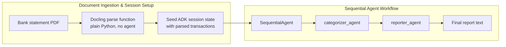

# ADK Pipeline (Section 2.4)

This rebuilds the same mixed pipeline from `docs/pipeline.md` inside Google's Agent Development Kit, instead of the hand-wired Python function calls used in the Section 2.3 pipeline. The architecture doesn't change; how it's orchestrated does.

## Why parsing still isn't an agent

`adk_pipeline/tools.py` wraps the Docling parser as a plain Python function. `adk_pipeline/pipeline.py` calls that function directly, before any agent runs, rather than wrapping it as a third agent in the chain. There's exactly one correct way to parse a given file; no reasoning or tool-selection decision is involved. Letting a model decide whether or how to call the parser would reintroduce the exact risk this whole chapter argues against removing. Only the categorizer and reporter are real `Agent` instances, since categorization and summarization are the parts that genuinely benefit from reasoning over already-structured data.



## Running it

```
uv sync
uv run python -m adk_pipeline.pipeline sample_data/citi_replica_statement.pdf
```

Generate the replica statement first if you haven't:

```
uv run python make_citi_replica.py
```

You can also point it at any statement generated by `mock_statements.py` or `make_sample_statement.py`.

## On ADK API stability

This is written against the commonly documented `Agent` / `SequentialAgent` / `Runner` / session-service pattern. ADK is a fast-moving framework, and exact method signatures, particularly around sync vs async session creation, have shifted between releases. If something here throws an `AttributeError` or `TypeError` on your installed version, check `python -c "import google.adk; print(google.adk.__version__)"` and the current docs at adk.dev before assuming the logic itself is wrong; it's more likely a version mismatch in a method name than an architectural error.

## Comparing this to the hand-wired version

The hand-wired Section 2.3 pipeline passes a pandas DataFrame between plain Python functions, no real session state, no structured handoff protocol. This version uses ADK's `output_key` mechanism to pass state between agents and a session service that could, in principle, persist across multiple turns (e.g., "now ask a follow-up question about this statement"), which the hand-wired version has no way to do. That's the concrete payoff of 2.4 over 2.3: not better parsing, better orchestration of the exact same architecture.

## Note on the replica statement

`make_citi_replica.py` builds a sanitized version of the same dense, multi-section layout that exposed Docling's table-structure bug (documented in `docs/pipeline.md`: a dropped Pizza Hut row and a corrupted Park'N Go description), using fictional identity and account details. The merchants, dates, and amounts are preserved exactly, since they're generic business trade names, not personal data.

Worth being direct about a limitation here: rebuilding the replica's table structure to match the real statement's actual layout, a single date column that sometimes holds one line of text and sometimes two, rather than the two-column approximation used in an earlier version, still did not reliably reproduce the original misparse in testing. Docling parsed the corrected replica cleanly. That suggests the original failure likely depends on something below the logical table structure, exact font metrics, character spacing, or how the source PDF's internal text-positioning objects are laid out, that a ReportLab-generated file doesn't replicate even when the row/column layout matches. Treat this replica as a demonstration of the structural pattern associated with the bug, not a guaranteed repro of it.
