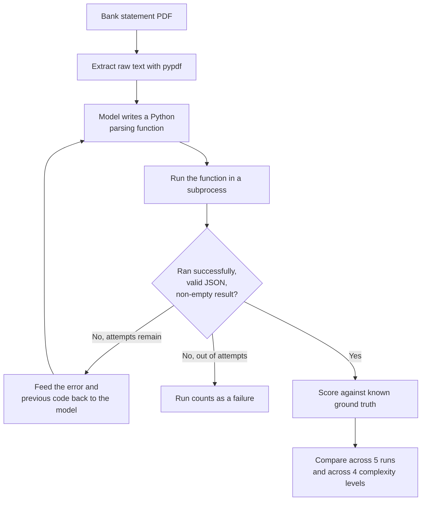

# Monolith Complexity Experiment

This documents the demo behind chapter section 2.1-2.2 ("The failure of the single-prompt agent" / "Why overconfident orchestration collapses in production"). It uses no agent framework at all, no AutoGen, no ADK, just plain Python control flow and a direct Gemini API call, because the claim being tested ("a single-model design becomes brittle at scale") doesn't depend on any orchestration framework. The framework comparison is reserved for section 2.4.

## Why this isn't a direct-extraction test

The first version of this experiment asked the model to read already-extracted statement text and return structured JSON directly, no code generation involved. That version scored 100% across all four complexity levels, every run, with identical output every time. That's a legitimate result, but it tested the wrong task: reading clean text and reformatting it as JSON is not what actually broke in the original hackathon project. The original failure was in a Data Analyzer agent *writing Python code* to parse raw statement text, and a Code Executor *running* that code, a mechanically fragile loop where the model has to get column assumptions, string matching, and control flow exactly right, or the code throws an exception. This version reproduces that mechanism instead.

## The design being tested

A single model writes a Python function that parses the statement text into transactions. That code gets executed in a subprocess. If it fails, either it throws an exception, times out, returns something that isn't valid JSON, or returns an empty list (an empty result counts as a failure here, since every test statement genuinely contains 10 transactions), the same model gets the error message and its own previous code, and tries again, up to a configurable number of attempts (`MAX_CODEGEN_ATTEMPTS` in `.env`, default 3). This is still a single, undifferentiated model doing everything, writing and implicitly debugging, with no separate specialized agents and no orchestration framework, which is what makes it "monolithic" in the chapter's sense.



## The four complexity levels

All four levels hold the exact same 10 transactions constant, only the page layout changes.

| Level | Name | What changes |
|---|---|---|
| 1 | Clean | One table, one header row, nothing else on the page |
| 2 | Sectioned | Adds an account summary block and section labels interleaved between rows |
| 3 | Dual dates + split header | Column header splits across two lines, some rows show two stacked dates |
| 4 | Dense / multi-section | Combines levels 2 and 3, plus a trailing fees/interest/APR block after the ledger |

## Scoring

Each run is scored against the fixed 10-transaction ground truth by matching on `(date, amount)` pairs, plus two metrics specific to the code-gen loop:

- **attempts**: how many write-execute-fix cycles it took to get working code (or the max if it never succeeded)
- **code_hash**: a fingerprint of the generated code, used to check whether independent runs on identical input converge on the same implementation or produce genuinely different code each time

## Results

Run against `gemini-3.1-flash-lite`, temperature 0.7, 5 runs per level, max 3 attempts per run.

| Level | Description | Success rate | Avg attempts used | Avg matched / 10 | Distinct code versions |
|---|---|---|---|---|---|
| 1 | Clean | 100% | 1.0 | 10.0 | 5 of 5 |
| 2 | Sectioned | 100% | 1.0 | 10.0 | 3 of 5 |
| 3 | Dual dates + split header | 80% | 2.6 | 8.0 | 5 of 5 |
| 4 | Dense / multi-section | 40% | 3.0 | 4.0 | 5 of 5 |

Success rate, attempts required, and matched-transaction count all degrade monotonically as layout complexity increases, on identical underlying data. Only the page layout changed between levels.

The detail worth calling out specifically: at level 4, every run, successes and failures alike, used all 3 attempts. The model never got the parsing code right on its first try at this complexity level, and even with the exact error message fed back to it, self-correction only recovered a working result 2 times out of 5. That's the concrete version of "identical input, different output": the same PDF, the same prompt, the same error-correction opportunity, produced a working parser three-fifths of the time and a complete miss two-fifths of the time.

Code-hash diversity is a weaker, secondary signal here. Level 2's "3 of 5" distinct versions isn't necessarily meaningful with only 5 samples, since superficial code differences (variable names, formatting) don't imply functional differences. Success rate, attempts, and matched count are the metrics doing the real work in this table.

Raw per-run data from this run:

```csv
level,level_name,run,success,attempts,extracted_count,matched_count,missed_count,hallucinated_count,code_hash
1,Clean,1,True,1,10,10,0,0,a9b60fed47
1,Clean,2,True,1,10,10,0,0,1d5189f8fb
1,Clean,3,True,1,10,10,0,0,d1c3195da5
1,Clean,4,True,1,10,10,0,0,98bef1c1a7
1,Clean,5,True,1,10,10,0,0,c49971acdc
2,Sectioned,1,True,1,10,10,0,0,2e1bc8e07b
2,Sectioned,2,True,1,10,10,0,0,2e1bc8e07b
2,Sectioned,3,True,1,10,10,0,0,2e1bc8e07b
2,Sectioned,4,True,1,10,10,0,0,9f0dc31fd3
2,Sectioned,5,True,1,10,10,0,0,e7a74dd066
3,Dual dates + split header,1,True,3,10,10,0,0,1dd5dc39d0
3,Dual dates + split header,2,True,3,10,10,0,0,235812c577
3,Dual dates + split header,3,True,3,10,10,0,0,21a20cb871
3,Dual dates + split header,4,True,1,10,10,0,0,9137afdc28
3,Dual dates + split header,5,False,3,0,0,10,0,a00a06d9cf
4,Dense / multi-section,1,True,3,10,10,0,0,0ea6116f72
4,Dense / multi-section,2,True,3,10,10,0,0,2b0e83b46c
4,Dense / multi-section,3,False,3,0,0,10,0,be995bff9d
4,Dense / multi-section,4,False,3,0,0,10,0,fbaa1ca6ef
4,Dense / multi-section,5,False,3,0,0,10,0,e09a5e9354
```

This is one run of a stochastic process; rerunning the experiment will produce different individual outcomes, though the same degradation pattern should hold given the same model and settings.

## Running it yourself

```
cp .env.example .env
# edit .env: add GOOGLE_API_KEY, optionally adjust MODEL_NAME and MAX_CODEGEN_ATTEMPTS
uv sync
uv run python run_complexity_experiment.py
```

Generated code executes in a subprocess with a timeout, not in a hardened sandbox. This is fine for a local demo against synthetic statements you generated yourself; don't run it against untrusted PDFs or on a machine you don't control.

New results land in `results/complexity_results.csv` (raw per-run) and `results/complexity_results.md` (the summary table). Neither is committed to this repo by default; the numbers above are preserved directly in this file since they're the specific run referenced in the chapter.
