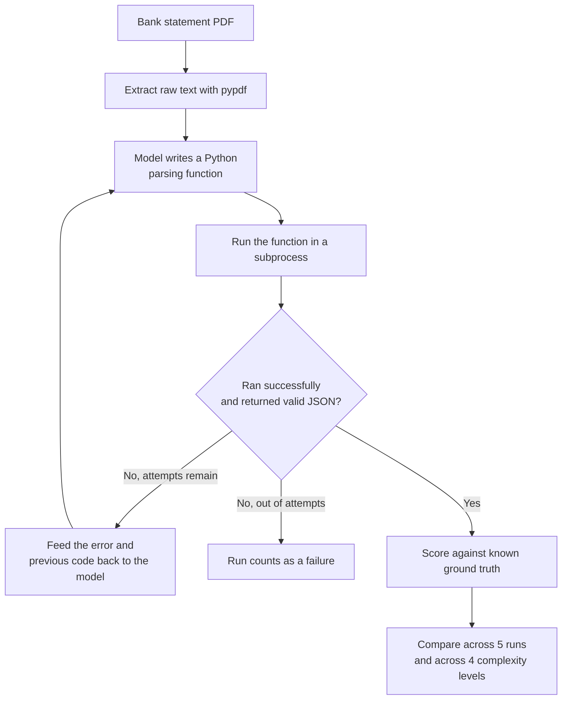

# Monolith Complexity Experiment

This documents the demo behind chapter section 2.1-2.2 ("The failure of the single-prompt agent" / "Why overconfident orchestration collapses in production"). It uses no agent framework at all, no AutoGen, no ADK, just plain Python control flow and a direct Gemini API call, because the claim being tested ("a single-model design becomes brittle at scale") doesn't depend on any orchestration framework. The framework comparison is reserved for section 2.4.

## Why this isn't a direct-extraction test

The first version of this experiment asked the model to read already-extracted statement text and return structured JSON directly, no code generation involved. That version scored 100% across all four complexity levels, every run, with identical output every time. That's a legitimate result, but it tested the wrong task: reading clean text and reformatting it as JSON is not what actually broke in the original hackathon project. The original failure was in a Data Analyzer agent *writing Python code* to parse raw statement text, and a Code Executor *running* that code, a mechanically fragile loop where the model has to get column assumptions, string matching, and control flow exactly right, or the code throws an exception. This version reproduces that mechanism instead.

## The design being tested

A single model writes a Python function that parses the statement text into transactions. That code gets executed in a subprocess. If it fails, either it throws an exception, times out, or returns something that isn't valid JSON, the same model gets the error message and its own previous code, and tries again, up to a configurable number of attempts (`MAX_CODEGEN_ATTEMPTS` in `.env`, default 3). This is still a single, undifferentiated model doing everything, writing and implicitly debugging, with no separate specialized agents and no orchestration framework, which is what makes it "monolithic" in the chapter's sense.



## The four complexity levels

Unchanged from the original design. All four levels hold the exact same 10 transactions constant, only the page layout changes.

| Level | Name | What changes |
|---|---|---|
| 1 | Clean | One table, one header row, nothing else on the page |
| 2 | Sectioned | Adds an account summary block and section labels interleaved between rows |
| 3 | Dual dates + split header | Column header splits across two lines, some rows show two stacked dates |
| 4 | Dense / multi-section | Combines levels 2 and 3, plus a trailing fees/interest/APR block after the ledger |

## Scoring

Each run is scored against the fixed 10-transaction ground truth by matching on `(date, amount)` pairs, plus two metrics specific to the code-gen loop:

- **attempts**: how many write-execute-fix cycles it took to get working code (or the max if it never succeeded)
- **code_hash**: a fingerprint of the generated code, used to check whether independent runs on identical input converge on the same implementation or produce genuinely different code each time

## Running it

```
cp .env.example .env
# edit .env: add GOOGLE_API_KEY, optionally adjust MODEL_NAME and MAX_CODEGEN_ATTEMPTS
uv sync
uv run python run_complexity_experiment.py
```

Generated code executes in a subprocess with a timeout, not in a hardened sandbox. This is fine for a local demo against synthetic statements you generated yourself; don't run it against untrusted PDFs or on a machine you don't control.

Results land in `results/complexity_results.csv` (raw per-run) and `results/complexity_results.md` (the summary table). Neither is committed to this repo, since the numbers only mean something once you've actually run the experiment.

## What to look for

Watch success rate, average attempts used, and code_hash diversity across the four levels. If the chapter's claim holds, level 1 should mostly succeed on the first attempt with a small number of distinct code versions, and level 4 should show more retries, lower success rates, and more distinct code versions across otherwise-identical runs, that's the direct evidence of "identical input, different output" this chapter section is arguing for. If it doesn't show up, that's worth reporting honestly, same as the direct-extraction version above.
