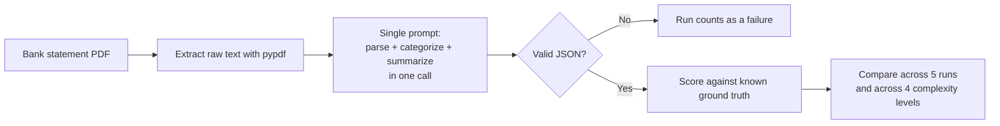

# Monolith Complexity Experiment

This documents the demo behind chapter section 2.1-2.2 ("The failure of the single-prompt agent" / "Why overconfident orchestration collapses in production"). It deliberately uses no agent framework at all, no AutoGen, no ADK, just one prompt and a direct Gemini API call, because the claim being tested ("a single-prompt design becomes brittle at scale") doesn't depend on any particular orchestration framework. The framework comparison is reserved for section 2.4.

## The design being tested

One prompt asks a model to do three things at once: extract every transaction, categorize each one, and write a short summary, all in a single call, all expected back as one JSON blob. This mirrors the original hackathon project's initial ambition: one system that reads a statement and answers anything about it, no decomposition, no specialized tooling.



## The four complexity levels

All four levels hold the exact same 10 transactions constant, only the page layout changes. This isolates layout complexity as the variable under test, rather than confounding it with a longer or harder transaction list.

| Level | Name | What changes |
|---|---|---|
| 1 | Clean | One table, one header row, nothing else on the page |
| 2 | Sectioned | Adds an account summary block and section labels ('Standard Purchases', 'Deposits') interleaved between rows |
| 3 | Dual dates + split header | Column header splits across two lines ('Sale' / 'Date'), some rows show two stacked dates |
| 4 | Dense / multi-section | Combines levels 2 and 3, plus a trailing fees/interest/APR block after the ledger, mimicking a real dense card statement |

Level 4 is a synthetic stand-in for the real Citi statement structure already documented in `docs/pipeline.md`, built so it can be shared and rerun without exposing anyone's real financial data.

## Scoring

Each run is scored against the fixed 10-transaction ground truth by matching on `(date, amount)` pairs:

- **matched_count**: how many of the 10 real transactions were correctly extracted
- **hallucinated_count**: extracted rows that don't correspond to any real transaction
- **valid_json**: whether the model's response parsed as JSON at all
- **signature**: a fingerprint of the exact set of `(date, amount)` pairs returned, used to check whether repeated runs on identical input agree with each other

## Running it

```
cp .env.example .env
# edit .env and add your GOOGLE_API_KEY
uv sync
uv run python run_complexity_experiment.py
```

This makes 20 API calls (4 levels x 5 runs) using the model set in `.env` (`MODEL_NAME`, defaults to `gemini-2.0-flash`). Results land in `results/complexity_results.csv` (raw, per-run) and `results/complexity_results.md` (the summary table for the chapter). Neither file is committed to this repo since the numbers only mean something once you've actually run the experiment; commit `results/complexity_results.md` yourself once you have real output you want to keep.

## What to look for

The chapter's claim is that valid-JSON rate, matched-transaction count, and run-to-run agreement all degrade as layout complexity increases from level 1 to level 4. If that pattern doesn't show up, or shows up differently than expected, that's worth reporting honestly rather than adjusted after the fact, since the whole point of building this instead of asserting it in prose is to let the data say what it says.
