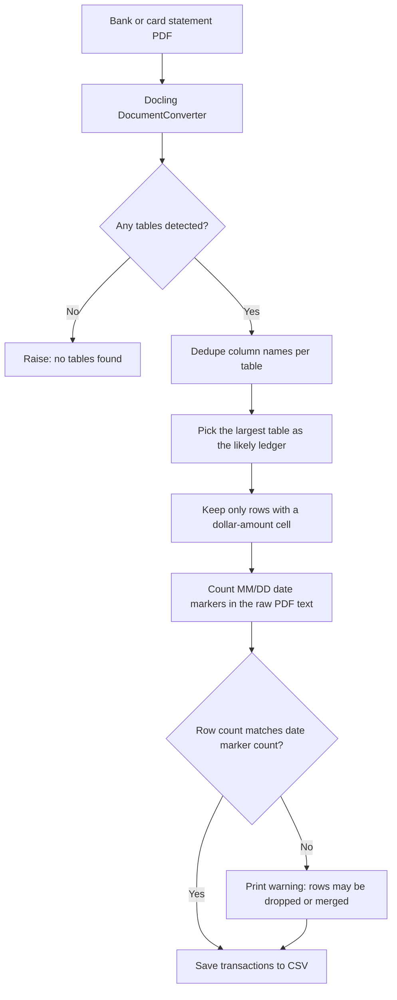
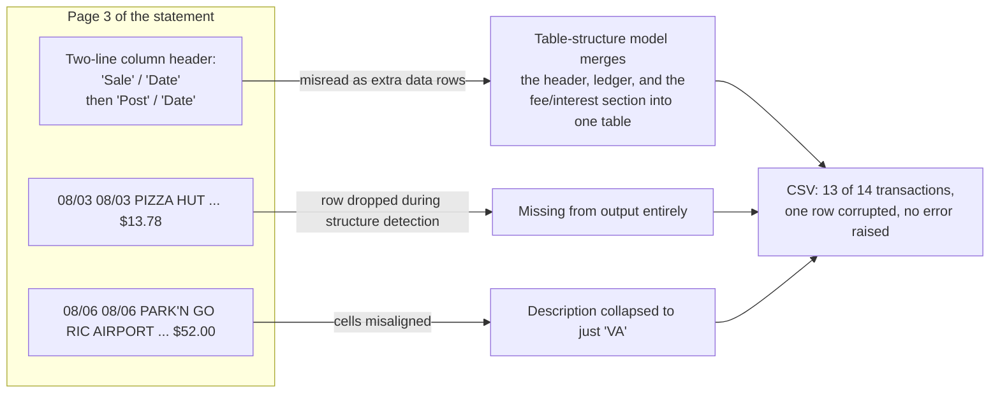

# Docling Parsing Pipeline (Section 2.3)

Two diagrams for the chapter. The first shows the pipeline as built. The second shows what actually happened when the pipeline was tested against a real Citi credit card statement, which is the failure case described in the text.

## How a statement flows through the pipeline

The date-marker count in step G comes from a second, independent pass over the PDF's text layer using `pypdf`. It doesn't rely on Docling's table model at all, which is the point: if the table model silently drops or merges a row, this check has a chance to catch it because it never touches the table object in the first place.

## What happened on the real test statement

Against a synthetic sample statement, this pipeline works cleanly end to end. Against a real six-page Citi credit card statement, it extracted 13 of 14 transactions correctly. Here is why:

The text layer of the PDF was intact for both rows, this was not a text-extraction failure. Docling's table-structure model drew the grid lines wrong on a dense, multi-section page, and neither Docling nor the parsing script raised an error. Nothing in the output looked broken unless you counted rows by hand against the source PDF. That silent-failure quality is the reason the row-count cross-check in the diagram above exists: catching this kind of miss requires checking the tool's output against something the tool itself didn't produce.
